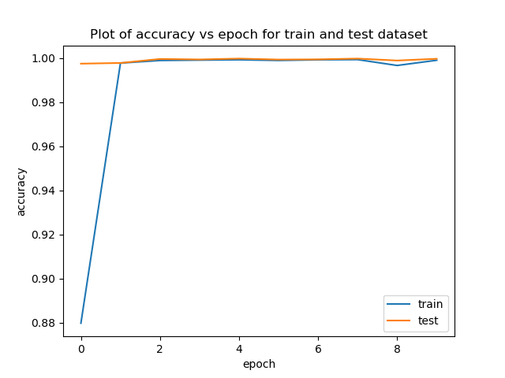

## Code for Network Administration course, using Deep Neural Network to classify DDoS Attack's type in NSL-KDD Dataset

Use Anaconda or Miniconda to create environment for run project with command:

```
conda env create -f environment.yml
```

### Accuracy and loss with VGG:

|           Accuracy            |              Loss              |
|:-----------------------------:|:------------------------------:|
|  |  |

Inference time : ~32ms

### Accuracy and loss with DenseNet:

|              Accuracy              |                Loss                 |
|:----------------------------------:|:-----------------------------------:|
|  |  |

Inference time : ~29ms
